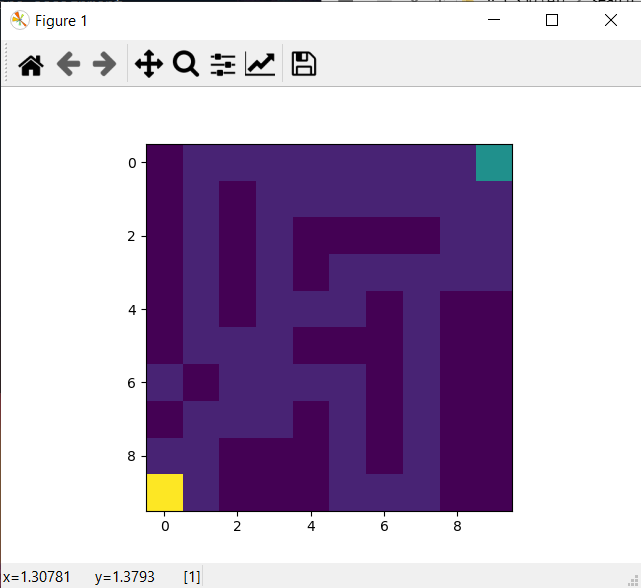
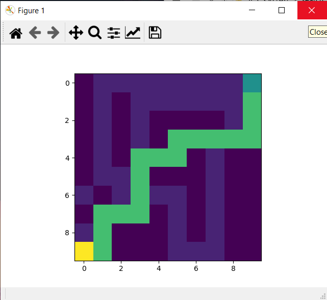
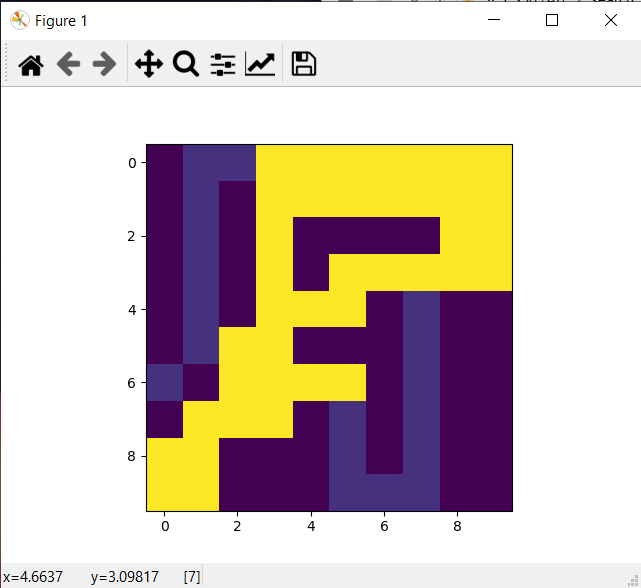

# Path-finding
Path finding algorithms and their visualizations

## How to Use:
* Clone the repository:
    ```sh
    git clone https://github.com/remag2069/Path-finding
    ```
* Install tkinter:
    ```sh
    pip install tkinter
    ```
* Run the main.py file for a demo:
    ```sh
    cd Path-finding
    python interactive_search1.py
    ```

* This will open a window containing yellow (starting point) and green (ending point) now the black boxes are walls while the white ones are paths.
* Clicking on the boxes (other than starting and ending ones) will change their behaviour respectively.
* After creating a maze select from the "menu" tool to run an algorithm
* Which will generate:
  * The map in digitized format:
    
  * The solution to the maze provided:
    
  * The collection of all paths tried before reaching the solution (Cost)
    

## Results:
* It can be concluded from [these](https://github.com/remag2069/Path-finding/tree/master/outputs) images that the A* algorithms is the best solution in terms of finding the optimal path with minimal cost